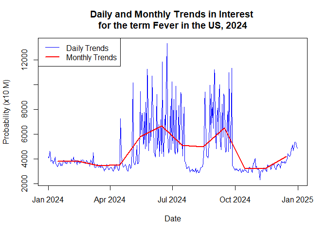

<!-- README.md is generated from README.Rmd. Please edit that file -->

# gtrendshealth: Query the Google Trends for Health API

<!-- badges: start -->

[](https://github.com/CDCgov/gtrendshealth/actions/workflows/R-CMD-check.yaml)
[](https://app.codecov.io/gh/CDCgov/gtrendshealth)
<!-- badges: end -->

## Overview

This package connects to the Google Trends for Health API to query
Google Trends for projects authorized to use the health research data.
It fetches a graph of search volumes per time within a set of
restrictions. Each term will result in a timeline of search over time.
Note the data is sampled and Google can’t guarantee the accuracy of the
numbers. This service is closed to a subset of Health researchers. The
quota provision is individually maintained by the Trends team.

You will need an API key from your Google Developer project authorized
for Google Trends for Health API use. A key can be acquired by
requesting access at
<https://support.google.com/trends/contact/trends_api> and following the
setup instructions.

## Installation

Install the package from CRAN using:

``` r
install.packages("gtrendshealth")
```

Install the development version from CDCgov GitHub using:

``` r
remotes::install_github("CDCgov/gtrendshealth")
```

## Usage

After receiving access to the Google Trends for Health API and setting
up your Google Developer project, generate an API key, and set it up for
use in your R installation:

``` r
library(package = "gtrendshealth")

set_gt_api_key(
  key = "{your-key}",
  install = TRUE
)
```

By default, the key is installed in the `.Renviron` file in your home
folder, and will be loaded into the `GOOGLE_TRENDS_FOR_HEALTH_API_KEY`
environment variable every time you start R. If you only want the key
for the active session, use `install = FALSE`.

``` r
library(package = "gtrendshealth")

# Query the Google Trends for Health service
monthly_trends <- get_health_trends(
  terms = "fever",
  resolution = "month",
  start = as.Date("2024-01-01"),
  end = as.Date("2024-12-31"),
  country = "US"
)

# set a date for each monthly observation
# using the 15th of each month for the day
monthly_trends$date <- as.Date(
  strptime(
    paste("15", monthly_trends$period),
    format = "%d %b %Y"
  )
)

head(monthly_trends)
#>    term    value       date   period geo
#> 1 fever 3762.237 2024-01-15 Jan 2024  US
#> 2 fever 3791.168 2024-02-15 Feb 2024  US
#> 3 fever 3390.748 2024-03-15 Mar 2024  US
#> 4 fever 3524.479 2024-04-15 Apr 2024  US
#> 5 fever 5838.251 2024-05-15 May 2024  US
#> 6 fever 6565.209 2024-06-15 Jun 2024  US

# Query the Google Trends for Health service
daily_trends <- get_health_trends(
  terms = "fever",
  resolution = "day",
  start = as.Date("2024-01-01"),
  end = as.Date("2024-12-31"),
  country = "US"
)

head(daily_trends)
#>    term    value       date period geo
#> 1 fever 4147.128 2024-01-01    day  US
#> 2 fever 3970.826 2024-01-02    day  US
#> 3 fever 4429.987 2024-01-03    day  US
#> 4 fever 4468.318 2024-01-04    day  US
#> 5 fever 3815.104 2024-01-05    day  US
#> 6 fever 3837.251 2024-01-06    day  US

# plot the time series
plot(
  daily_trends$date, daily_trends$value, type = "l", col = "blue",
  xlab = "Date",
  ylab = "Value",
  main = "Daily and Monthly Trends for Fever in the US, 2024"
)
lines(monthly_trends$date, monthly_trends$value, col = "red", lwd = 2)
legend("topleft", legend = c("Daily Trends", "Monthly Trends"),
       col = c("blue", "red"), lty = 1, lwd = c(1, 2))
```


